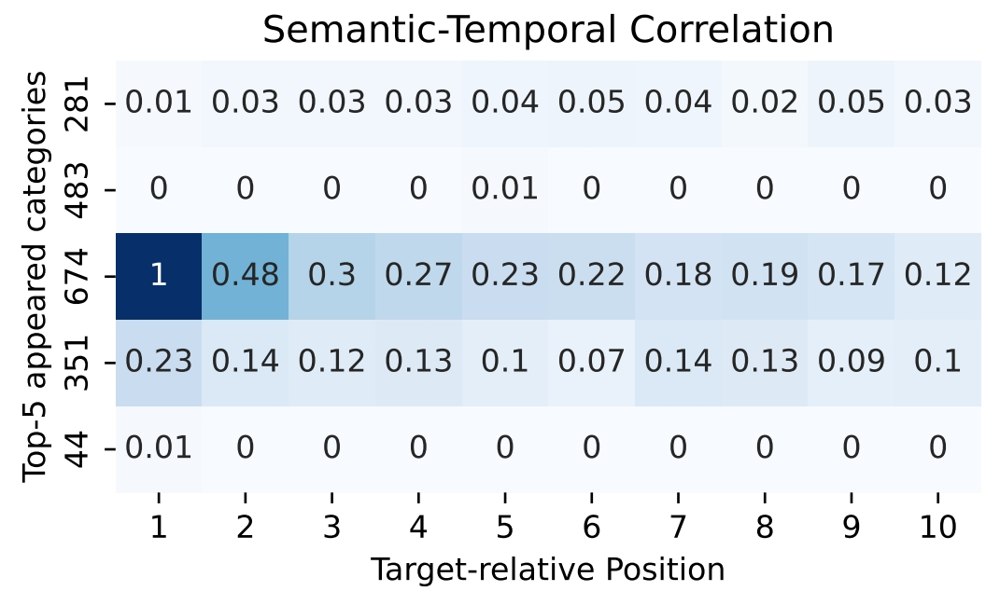
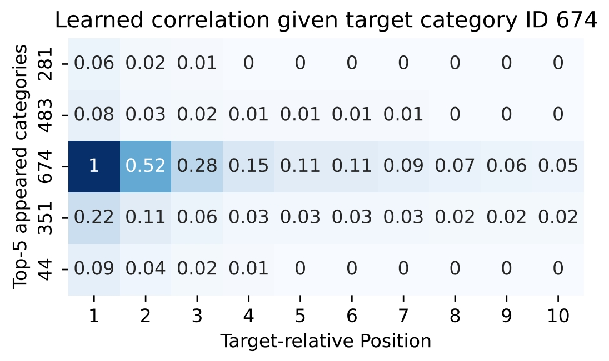

# Feature Correlation


We are interested in the *ground truth* and *learned* correlation between features X and labels Y. In user interest modeling, especially in target attention [1], we focus on the correlation between user's behaviors and her response on the target item. The same analysis tool described below can be easily extended to general feature correlation analysis [3]. In particular, we are interested in the following Research Questions (RQ), which are discussed extensively in [2].

1. RQ1, How can we measure the *ground-truth correlation* between behaviors and the target?
2. RQ2, How can we measure the *learned correlation* between behaviors and the target?
3. RQ3, What's the general pattern of behavior-target correlation?

# RQ1, Ground-truth Correlation

Given behaviors satisfying some given conditions $con_b$, represented as $X_{con_b}$, and user's response on targets with conditions $con_t$, represented as $Y_{con_t}$, the correlation between them can be defined as the mutual information between these two variables:

$$MI(X_{con_b}, Y_{con_t})$$

For example, we define the Category-wise Target-aware Correlation (CTC) as the mutual information between behaviors with category $c_i$ whilst occurring at position $p$: $X_{C(X)=c_i \land P(X)=p}$ and the user response label on the target item with category $c_t$: $Y_{C(Y)=c_t}$. Formally,

$$Cor = MI \left(X_{C(X)=c_i \land P(X)=p},  Y_{C(Y)=c_t}\right)$$

where $C(\cdot)$, $P(\cdot)$ denotes the category or position of the behavior or target. 

# RQ2, Learned Correlation

Here we outline how to measure the learned semantic-temporal correlation of TIN [2]. The learned semantic-temporal correlation between behavior $X_{i}$ at position $f(X_i)$ and target $X_{t}$ is defined as:

$$Cor(f(X_i),\tilde{\mathbf{e}}_i,\tilde{\mathbf{v}}_t) = e^{z} \cdot |r|_2$$


where $z = \langle \tilde{\mathbf{e}}_i, \tilde{\mathbf{v}}_t \rangle$ represents the attention logits (dot products between behavior and target embeddings) and $\mathbf{r} = \tilde{\mathbf{e}}_i \odot \tilde{\mathbf{v}}_t$ denotes the representation embedding. 

We chose this form since there are connections between the mutual information and the parameterized (intermediate) output of the interaction of two variables.
In our model, the intermediate parameterized output of the interaction before the MLPs is proportional to $e^{z} \cdot \mathbf{r}$. For instance, the learned semantic-temporal correlation of TIN can be defined as:

$$Cor(f(X_i),e_i,v_t) = exp^{z} \cdot |r|_2$$

$$= exp^{\frac{\langle \tilde{\mathbf{e}}_i, \tilde{\mathbf{v}}_t \rangle}{\sqrt{d}}} \cdot |\tilde{\mathbf{e}}_i \odot \tilde{\mathbf{v}}_t|_2 $$


# Code

## Visualize the Category-wise Target-aware Correlation (CTC)
- Step 1: Preprocess the dataset and save the statistics for computing the Category-wise Target-aware Correlation.
    ```bash
    cd visualization
    python amazon_pre_pos.py
    ```
- Step 2: Compute and plot the Category-wise Target-aware Correlation.
    ```bash
    python amazon_mul_c_pos.py
    ```


<div align=center></div>


## Visualize the learned semantic-temporal correlation
- Step 1: Save the value of position embedding and category embedding of different models after training as `p.npy` and `c.npy`.
- Step 2: Compute the learned quadruple correlation.
    ```bash
    python temporal_correlation.py
    ```
    
<div align=center></div>

# RQ3, Correlation Patterns


For example, the CTC of behaviors with Top-5 categories at various target-relative positions and target with category $c_t = 674$ is illustrated in the first figure.
We have the following observation:
1) *semantic pattern between matching categories*: behaviors belonging to the same category as the target (the 3rd row, category 674) exhibit a higher degree of correlation compared to other categories. 
2) *temporal decaying pattern*: among the semantically correlated behaviors (*i.e.*, the 3rd row), there is a compelling correlation decrease from the most recent behaviors to the oldest ones. 

# References
1. Deep Interest Network for Click-through Rate Prediction. SIGKDD 2018.
2. Temporal Interest Network for User Response Prediction. WWW 2024.
3. Field-weighted Factorization Machines for Click-through Rate Prediction in Display Advertising. WWW 2018.
4. Rethinking Softmax with Cross-Entropy- Neural Network Classifier as Mutual Information Estimator. 2019.
